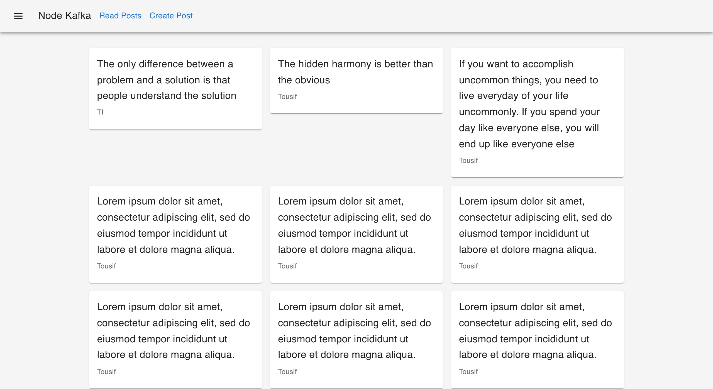

# Turborepo Node Kafka Graphql React

Objective: Demonstrate usage of kafka

[Kafka Fundamentals](https://www.youtube.com/watch?v=Ch5VhJzaoaI)


## Tools used

Build system: [Turborepo](https://turborepo.org/)

-   Global

    -   Node.js 16
    -   yarn
    -   docker-compose

-   API

    -   [KafkaJS](https://kafka.js.org/)
    -   [Kafka Graphql Subscriptions](https://github.com/tomasAlabes/graphql-kafkajs-subscriptions)
    -   [TypeGraphql](https://typegraphql.com/)
    -   [Fastify](fastify.io) / [Mercurius](https://mercurius.dev/)
    -   [Mikro ORM](https://mikro-orm.io/)
    -   Postgres
    -   Kafka

-   Frontend
    -   React
    -   [Vite](https://vitejs.dev)

## Workspaces

Workspaces can exist in these folders:

```text
apps
services
packages
```

### Predefined workspaces

In this starter kit these workspaces are defined already:

```text
apps
  - producer_server
  - consumer_server
  - ui
services
  - message_broker
  - postgres
packages
  - config
  - tsconfig
  - ui-components
```

## Usage

-   Install dependencies using `yarn install`
-   Start the stack using `yarn dev`
-   Browse [http://localhost:3000](http://localhost:3000)


`yarn dev` output


`http://localhost:3000` output
