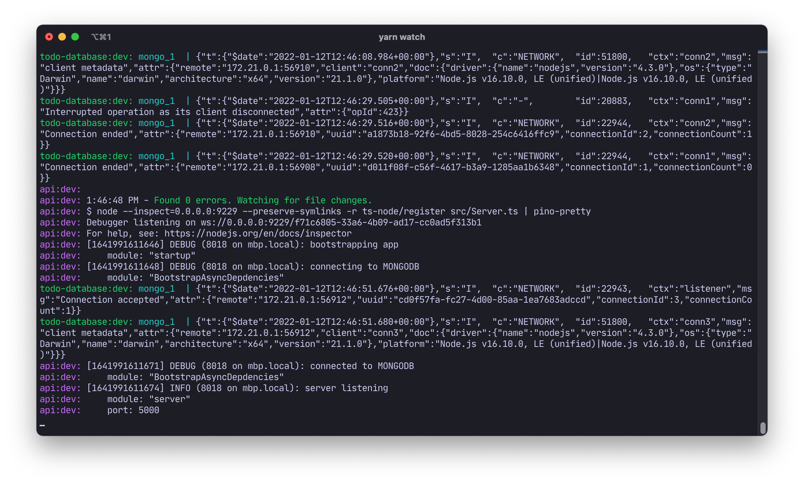
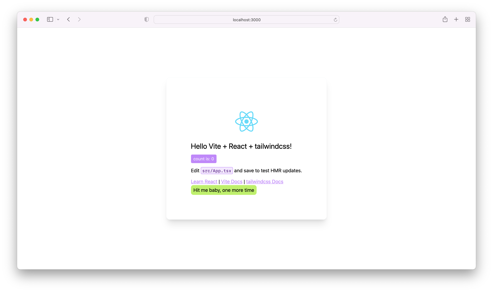

# turborepo-node-react-tailwind-starter

This repositoy contains a template for a mono-repo to run an API based on express as well as React based frontend.

## Tools used

* Global
  * yarn `1.22.17`
  * yarn workspaces
  * turbo
  * docker-compose
* API
  * Node.js 16.10.0
  * express
  * MongoDB
* Frontend
  * react
  * vite

## Workspaces

Workspaces can exist in these folders:

```text
apps
databases
packages
```

### Predefined workspaces

In this starter kit these workspaces are defined already:

```text
apps
  - api
  - ui
databases
  - todo-database
packages
  - config
  - tsconfig
  - ui-components
```

## Usage

### Setting up a new project using this template

* Create a new repository by clicking the "Use this template" button.
* Checkout your new repository
* Install depedencies using `yarn install`
* Start the stack using `yarn watch`
* Browse [http://localhost:3000](http://localhost:3000)


`yarn watch` output


`http://localhost:3000` output
