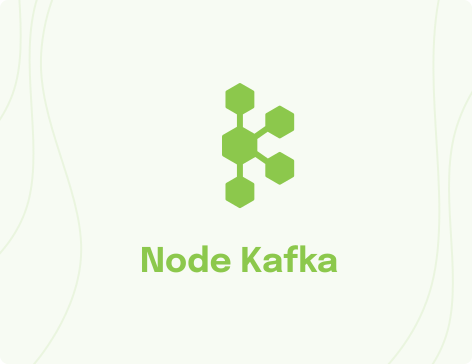
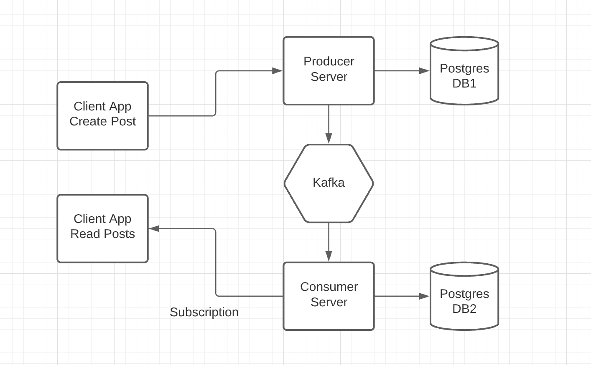
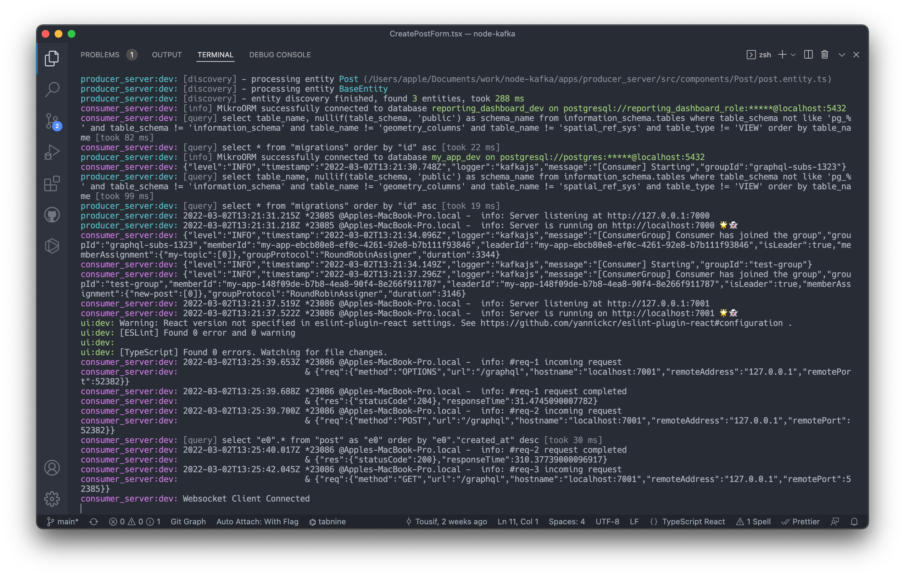
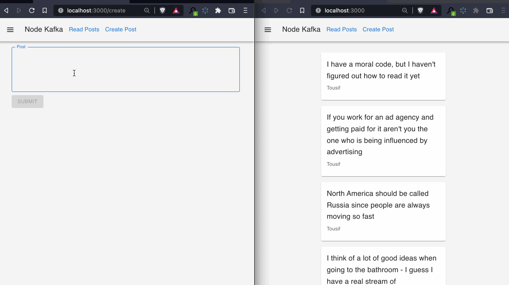
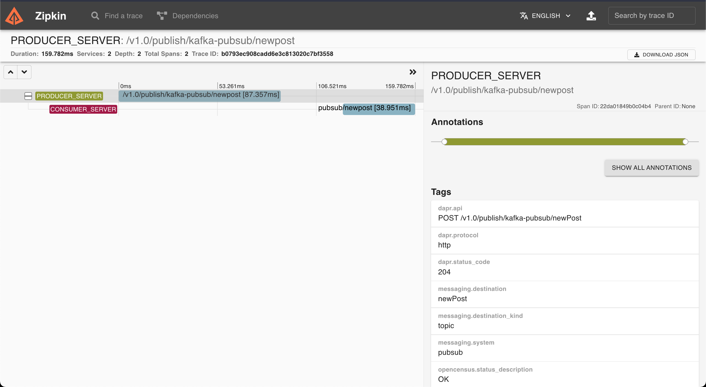

<div>
  <a href="https://www.wednesday.is/?utm_source=github&utm_medium=kafka-node-example" align="left" style="margin-left: 0;">
    
  </a>
  <p>
    <h1 align="left">Node Kafka </h1>
  </p>

  <p>
A Monorepo that hosts two web server and a web client. Purpose of this project is to demonstrate usage of Kafka and Dapr. We have one producer server that publishes messages to kafka and consumer server publishes that message web client after receiving the message from kafka
  </p>

---

  <p>
    <h4>
      Expert teams of digital product strategists, developers, and designers.
    </h4>
  </p>

  <div>
    <a href="https://www.wednesday.is/contact-us/?utm_source=github&utm_medium=kafka-node-example" target="_blank">
      
    </a>
    <a href="https://github.com/wednesday-solutions/" target="_blank">
      
    </a>
  </div>

---

<span>We’re always looking for people who value their work, so come and join us. <a href="https://www.wednesday.is/hiring/?utm_source=github&utm_medium=kafka-node-example">We are hiring!</a></span>

</div>

<hr/>

[Kafka Fundamentals](https://www.youtube.com/watch?v=Ch5VhJzaoaI)



## Tools used

Build system: [Turborepo](https://turborepo.org/)

-   Global

    -   Node.js 16
    -   yarn
    -   docker-compose
    -   [Dapr](https://dapr.io/) - Used to simplify microservice connectivity

-   API

    -   [KafkaJS](https://kafka.js.org/) - Kafka client for NodeJS
    -   [Kafka Graphql Subscriptions](https://github.com/tomasAlabes/graphql-kafkajs-subscriptions)
    -   [TypeGraphql](https://typegraphql.com/) - Code first Graphql
    -   [Fastify](fastify.io) / [Mercurius](https://mercurius.dev/) - Fastest web framework for NodeJS. Mercurius is the graphql adapter of Fastify.
    -   [Mikro ORM](https://mikro-orm.io/) - Awesome TypeScript ORM for NodeJS
    -   Postgres
    -   Kafka

-   Frontend
    -   React
    -   [Vite](https://vitejs.dev) - Next Gen Frontend build tool
    -   [Cypress](https://www.cypress.io) - E2E & Integration testing framework

## Workspaces

Workspaces can exist in these folders:

```text
apps
services
packages
```

### Predefined workspaces

In this starter kit these workspaces are defined already:

```text
apps
  - producer_server
  - consumer_server
  - ui
services
  - message_broker
  - postgres
packages
  - config
  - tsconfig
  - ui-components
```

## Usage

-   Install dependencies using `yarn install`
-   Start the stack using `yarn dev`
-   Start dapr `yarn dapr:run` (please make sure Kafka is running before running dapr)
-   Browse [http://localhost:3000](http://localhost:3000)

`yarn dev` output


`http://localhost:3000` output


`http://localhost:9411` output

